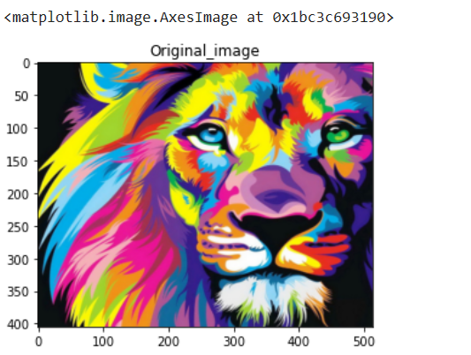
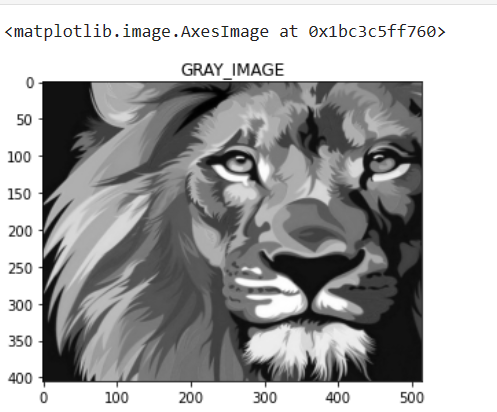
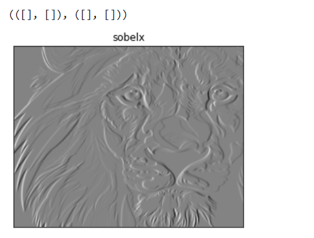
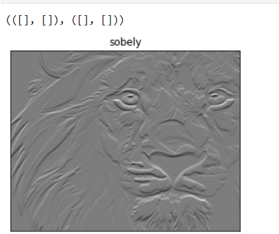
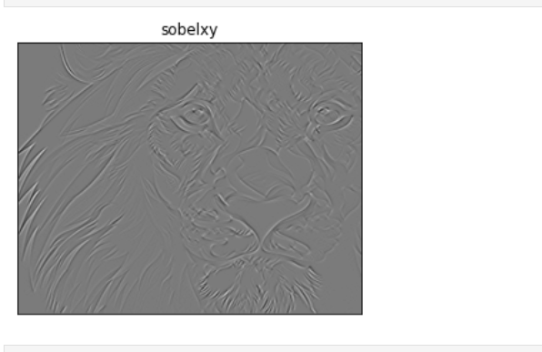
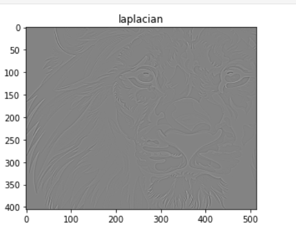
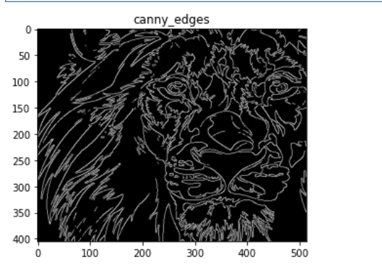

# Edge-Detection
## Aim:
To perform edge detection using Sobel, Laplacian, and Canny edge detectors.

## Software Required:
Anaconda - Python 3.7

## Algorithm:
### Step1:
Import all necessary modules.


### Step2:
For performing edge detection on a image.

*Sobel:
```
sobelx = cv2.Sobel(gray_img,cv2.CV_64F,1,0,ksize=5)
sobely = cv2.Sobel(gray_img,cv2.CV_64F,0,1,ksize=5)
sobelxy =cv2.Sobel(gray_img,cv2.CV_64F,1,1,ksize=5)
```

Laplacian:

laplacian = cv2.Laplacian(gray_img,cv2.CV_64F)

Canny:

canny_edges = cv2.Canny(gray_img, 120, 150)

### Step3:
Display all the images with respective edge detected images.

## Program:

``` 
Reg.No.:212221230107
Name: M.Sowmya
```
```
# Import the packages

import numpy as np
import cv2
import matplotlib.pyplot as plt


# Load the image, Convert to grayscale and remove noise

img=cv2.imread ('dip7.1.png')
img1=cv2.cvtColor(img,cv2.COLOR_BGR2RGB)
plt.title('Original_image')
plt.imshow(img1)

gray_img = cv2.cvtColor(img,cv2.COLOR_RGB2GRAY)
plt.title('GRAY_IMAGE')
plt.imshow(gray_img,cmap = 'gray')


# SOBEL EDGE DETECTOR
img = cv2.GaussianBlur(gray_img,(3,3),0)
sobelx = cv2.Sobel(gray_img,cv2.CV_64F,1,0,ksize=5)
sobely = cv2.Sobel(gray_img,cv2.CV_64F,0,1,ksize=5)
sobelxy =cv2.Sobel(gray_img,cv2.CV_64F,1,1,ksize=5)

plt.figure(1)
plt.subplot(1,1,1)
plt.imshow(gray_img,cmap = 'gray')
plt.title('Original'), plt.xticks([]), plt.yticks([])

plt.subplot(1,1,1)
plt.imshow(sobelx,cmap='gray')
plt.title('sobelx')
plt.xticks([]), plt.yticks([])

plt.subplot(1,1,1)
plt.imshow(sobely,cmap='gray')
plt.title('sobely')
plt.xticks([]), plt.yticks([])

plt.subplot(1,1,1)
plt.imshow(sobelxy,cmap='gray')
plt.title('sobelxy')
plt.xticks([]), plt.yticks([])
plt.show()


# LAPLACIAN EDGE DETECTOR
# cv2.waitKey(0)
laplacian = cv2.Laplacian(gray_img,cv2.CV_64F)
plt.imshow(laplacian,cmap='gray')
plt.title('laplacian')
plt.show()


# CANNY EDGE DETECTOR:
canny_edges = cv2.Canny(gray_img, 120, 150)
plt.imshow(canny_edges,cmap='gray')
plt.title('canny_edges')
plt.show()
```
## Output:



### SOBEL EDGE DETECTOR






### LAPLACIAN EDGE DETECTOR



### CANNY EDGE DETECTOR

## Result:
Thus the edges are detected using Sobel, Laplacian, and Canny edge detectors.
